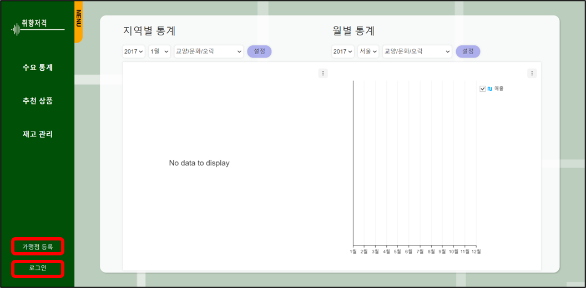
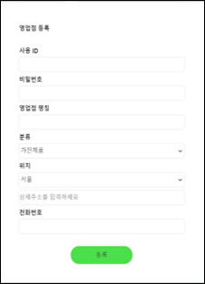
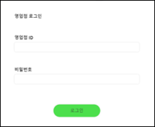
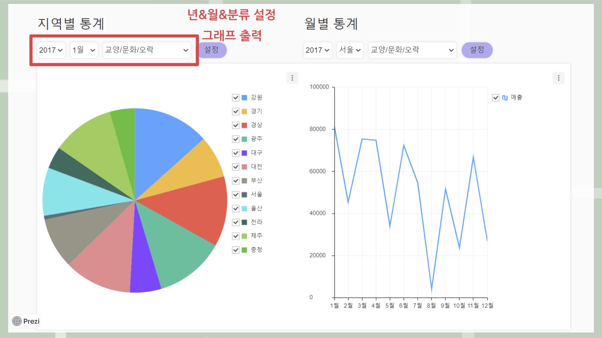
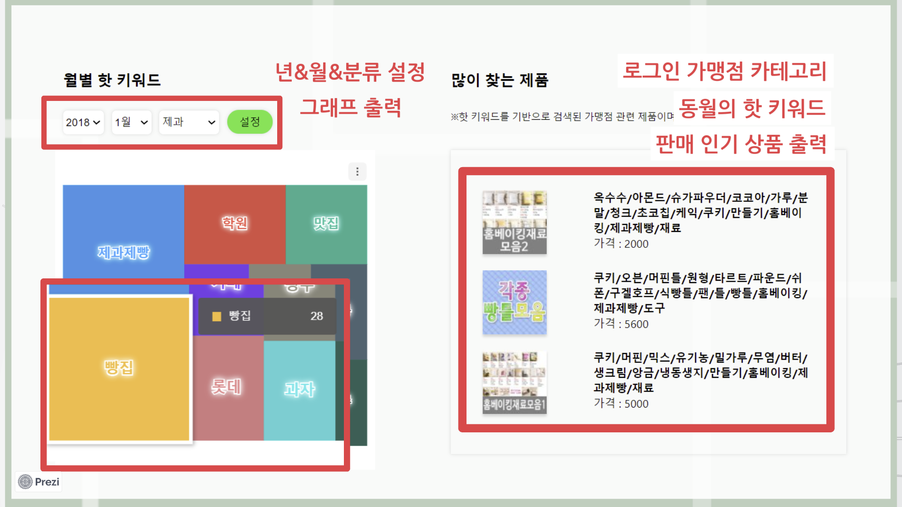
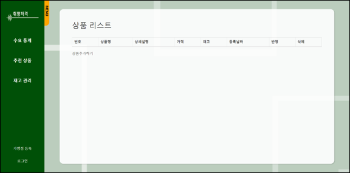

# predictionweb

대쉬보드 디자인을 도메인 이동없이 표현하기 위해 ReactFramework 사용

 

다양한 정보를 입력해 회원가입 할 수 있음 
MySQL DB에 저장됨
 
 
  

등록된 로그인 정보를 비교해 등록여부 확인
 
 

카드사용내역 데이터를 그래프로 표현 
조건을 선택해 원하는 데이터 확인 가능
 
 

<b>키워드 그래프</b> 
네이버 블로그 크롤링 데이터를 그래프로 표현 
조건을 선택해 원하는 데이터 확인 가능
  
<b>추천상품</b> 
현재 로그인 된 가맹점 분류 정보와 현재 날짜의 핫토픽을 검색해 결과 상품 출력
  

MySQL과 연동된 가맹점 재고 관리 가능
